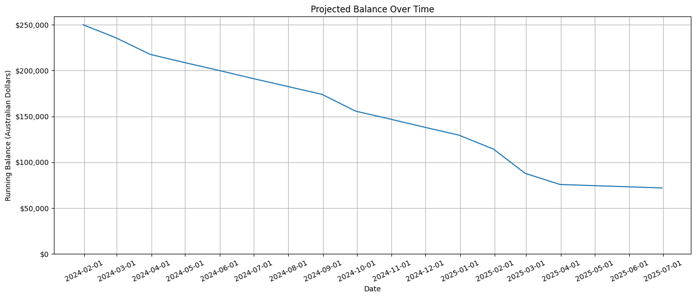
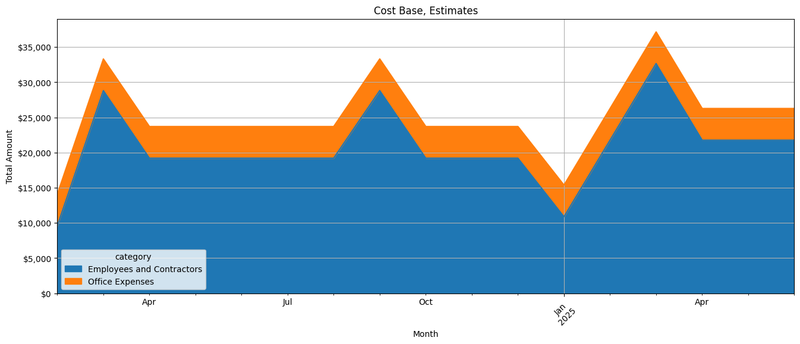

# fin-kit
Simple financial projection simulations for startups. 

## Overview
`fin-kit` is a Jupyter notebok for Python that takees a series of configuration files from the `components` directory and
projects your the financial state of a business. It's designed to make it easy to visualise complex cash-flow scenarios. It gives you:

- A day by day simulated financial ledger (csv)
- Cash-flow graphs for your running balance
- A stacked area chart of major cost areas.
- Conversion of AUD/GBP/USD costs.

## Contributions Welcome
We wrote this quickly to provide answers to VC's, speculative investors in our business in order to replace manually 
operated Excel sheets that often trailed reality, or were not flexible enough to let us project what-if scenarios
easily.

As such, there's a lot of areas to improve:

- More robust interval handling
- Comissions, charges and tax elements (cost of sales etc)
- Ability to work in other currencies, and use projected currency conversrion rates.

## Example Images
### Cash Flow
Show the cash-flow of the simualtion, so you can see when your runway ends.


### Costs Analysis
Show your cost base over time.


## Component Data Structure
Each component is a YAML file in the "components" folder.

```
type:         Expense
provider:     Jack Smith
description:  Sales
currency:     AUD
category:     Employees and Contractors
enabled:      true

start_date:    2024-01-01
align_date:    2024-02-04 # Use this to force some dates to line up, i.e. to model a payroll fortnightly

payment_schedule:
  - action:     repeat
    frequency:  weekly
    interval:   2
    note:       Fortnightly salary
    amount:     125000
    scalar:     1.11
    divisor:    26
    until:      2025-01-01
  # Annual increase IN 2025
  - action:     repeat
    frequency:  weekly
    interval:   2
    note:       Fortnightly salary
    amount:     145000
    scalar:     1.11
    divisor:    26
```

### Data Fields
| Field | Description | Notes |
|-|-|-|
| `type` | The core type of object | We typically set these as "Expense" or "Revenue". Expenses are multiplied by -1 so you don't need to enter negative values. |
| `provider` | Provider name or employee name | |
| `description` | Description of the item |
| `category` | Category grouping of these items, such as `Employees and Contractors` | Make sure you use these consistently |
| `currency` | Currency to use. | By default we convert everything to AUD, but the script is easily changed to use other currencies. |
| `start_date` | The start date | The earliest date this expense appears, unless an align-date is set. |
| `align_date` | Alignment data (adjusted start) | Use this to set a date for expenses different to their true start, such as where you want to pay employees at some on a schedule, such as fortnightly, or a contract is deferred value. |
| `enabled` | Enable this expense? Disable to ignore this item without deleting the file during what-if analysis. |

### Payment Schedules
Each component can vary its valuation over time. The fields of a payment schedule are:

| Field | Description | Notes |
|-|-|-|
| `action` | What action to take at this schedule entry? | `repeat`, `once` or `stop` entirely |
| `frequency` | How often to pay this expense or incur revneue | `daily`, `weekly`, `monthly`, `annually` |
| `interval` | How many multiples of the frequency between payments | i.e. Set to `weekly`, `2` to do fortnightly |
| `note` | Note text | Appears in the ledger CSV we generate, next to each item |
| `amount` | The amount to credit or debit from the account | Always positive values |
| `scalar` | Multiplier for the value | For example, to do Australian superannuation use a scalar of 1.11
| `divisor` | Division of amount to apply per repetition | For example, to do fortnightly payments set a divisor of 26.
| `until` | Stop repetitions at this date | Script will apply the next payment schedule thereafter | 